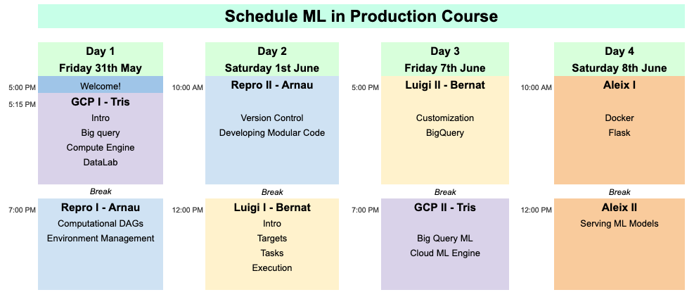

# 2019 edition - ML In Production

# What will you learn?

This course will introduce several tools that a succesful Data Scientist needs to master in order to maximize her impact:
- Working with cloud platforms
- Developing data processing pipelines
- Deploying scikit-learn and tensorflow models in production
- Good development practices for Data Scientists

The course will consist of mostly practical hands-on sessions. 

# Syllabus

* Reproducible Data Science
  * What do we mean by reproducibility and why it matters
  * Tools & practices for reproducible Data Science
	  * Version Control
	  * Data Science workflows as DAGs
	  * Environment management
	  * Developing modular code
* Luigi
  * General introduction
  * Python classes
  * Introduction to Luigi
  * Targets
  * Tasks
  * Execution
  * Customizing targets and tasks
  * BigQuery workflows
  * Best practices
  * A taste of Airflow
* Google Cloud Platform (GCP)
  * Introduction to GCP
  * Google Compute Engine
  * BigQuery
  * Building dashboards with Cloud Datalab
  * Building models with BigQuery ML
  * Cloud ML Engine
* Serving models
  * The problem of serving machine learning models
  * Putting everything inside a Docker container
  * Serving a Tensorflow or ScikitLearn model in a Flask app
  * Alternatives using GCP
  * Best practices

# Technologies used

[Git](https://git-scm.com/), conda/virtual environments, [Jupyter](https://jupyter.org/), [DVC](https://dvc.org/), [Google Cloud Platform](https://cloud.google.com/), [Luigi](https://luigi.readthedocs.io/en/stable/), [Docker](https://www.docker.com/), [Keras](https://keras.io/), [Tensorflow Serving](https://www.tensorflow.org/tfx/guide/serving), ... 

# Intended audience

This course is designed for Data Scientists with some development experience who want to:
- Become more independent from SW developers
- Become better data scientists by becoming better SW engineers
- Understand methodologies and processes to develop models at scale
- Adopt techniques and processes to better work in multidisciplinary teams

# Teachers

[**Bernat Garcia Larrosa**](https://www.linkedin.com/in/bernat-garcia-larrosa-9322869b/): Degree in mathematics and industrial engineer. Former data scientist at Diari ARA and LaVanguardia.com. Current Director of Big Data at yaencontre.

[**Tristana Sondon**](https://www.linkedin.com/in/tristanasondon/):  PhD in Computational Physics. Former Academic Researcher, has been working for the past 5 years in Management consulting on areas of Data Science for
banking, retail and ecommerce companies. Currently is Data Science Lead in the area of Revenue Managment and Dynamic Pricing.

[**Aleix Ruiz de Villa**](https://www.linkedin.com/in/aleixr/): PhD in mathematics. Founder of the Barcelona Data Science and Machine Learning Meetup, cofounder of the Barcelona R Users Group and cofounder of BaDaSS. Ex Head of Data Science of LaVanguardia.com, SCRM (Lidl) and Onna. Currently he is a consultant specialising in causal inference projects.

[**Arnau Tibau Puig**](https://www.linkedin.com/in/atibaup/): PhD in Electrical Engineering and flamenco lover. Former Principal Engineer at @WalmartLabs, Lead DS at Quantifind, both in the SF Bay Area. Current Head of Data Science at letgo, Barcelona.

# Schedule, Dates and Location

The course (16h in total) will be held in Barcelona on:
- Friday May 31st 17-21h
- Saturday June 1st 10-14h
- Friday June 7th 17-21h 
- Saturday 8th 10-14h

**Venue**: [Llibreria Laie](https://goo.gl/maps/bLJyseumEjuD5oaHA), 
Carrer de Pau Claris, 85, 08010 Barcelona

# Requirements (Important)

Students should have some experience with:
- Machine Learning 
- Python
- Unix command line tools 

Students must bring a laptop with
- Linux/MacOS 
- You favorite IDE (examples: Vim, Sublime, PyCharm, Emacs...)
- A configured environment as [explained here](env_setup/index.md)

**Important**: Please follow the [environment setup instructions](env_setup/index.md)
prior to the beginning of the course to ensure a smooth learning experience.

# Registration

Please register via [this form](https://forms.gle/LWkXdaLKnwDjxcpZ7)

Registration closes on Sunday May 26th.

The class size will be limited to 20 people. While we will try to accomodate everyone interested, we also reserve the right to select students based on their experience level, in order to maximize the chances of a succesful learning experience (in groups with similar knowledge). 

*Price*: 350 euros per person

BaDaSS members enjoy a 20% discount.

*Language*: English

*Contact*: bcn.mlinproduction@gmail.com

## Collaborations

In collaboration with [BaDaSS](https://badass.cat)

